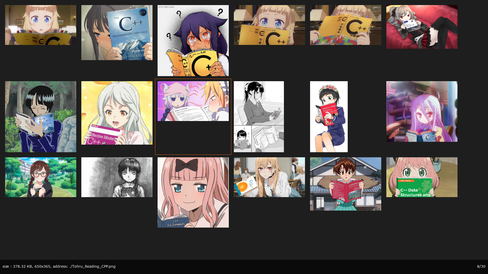
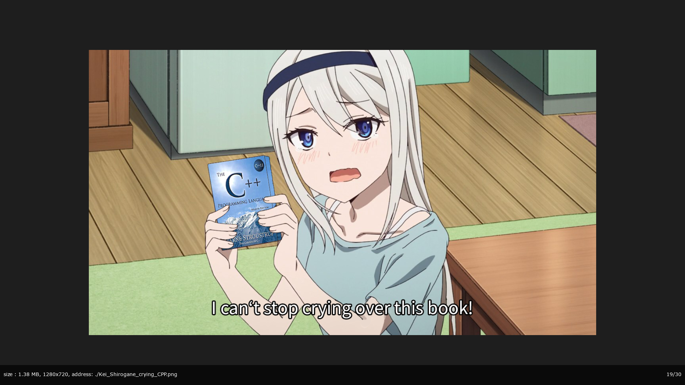

# Another image viewer
An image viewer implementation using C++17 and SDL2. It is heavily inspired on sxiv.

## Features
<div>

<p> Grid view mode</p>
</div>

<div>

<p> Image view mode</p>
</div>

<div>

<p> Image continuum view mode </p>
</div>

- Keyboard input only. Vim-like commands.
- Rendering of gif animations.
- Continuum view mode. You are able to scroll from top to bottom to see the images in a continuum way.
- When the program is closed, it will resume to the same image position when opened again with similar arguments. The way it works is that when you close the image viewer, is saves the path of the current image to a cache file. When you open it again and one of the input filenames matches a string in the cache, it moves the cursor to that image.
- Option to write to standard output the current image filename on exit, so it is possible to use this program in a way similar to dmenu, but for images.
- Custom key bindings to execute system commands.


## Usage
The command is "aiv". You can insert as command line arguments the filenames or directories for it to search images. You can also input the filenames or directories by pipeline.

## Custom bindings
The program search for the following config files in this order:
- "$XDG_CONFIG_HOME/aiv/key_commands.json".
- "$HOME/.config/aiv/key_commands.json".

The file is in json format, in which you writes pairs of the key mappings and the command to execute. The following is an example of possible key_commands.json file:
```
{
    "keyCommands": {
		"<C>y": "echo \"This is a command\"",
        	"<C>b": "echo $AIV_CURRENT_IMAGE",
		"<C>n": "echo $AIV_SELECTED_IMAGES"
    }
}
```
The <C> symbol is for detecting the Ctrl key. So, the previous file creates bindings for the keys "Ctrl+y", "Ctrl+b" and "Ctrl+n". Additionally, aiv exports the following environment variables to use in the system commands:
- AIV_CURRENT_IMAGE: Filename of the current image.
- AIV_SELECTED_IMAGES: A list of filenames of all selected images.
You should not use a key binding that is the same to one of the program, or a super set of them. Using <C> is always safe because none of the program commands use that key.
## Requirements to compile
clang 14.00+, meson, Make, Linux system.

## Keyboard input:
All commands with the symbol \<N\> accepts an optional number to modify the command. By default the number is 1.
### General:
- f: toggle fullscreen
- \<N\>n: next image
- \<SPACE\>: Set the current image as selected
- \<N\>p: previous image
- \<N\>gg: go to the image in the position N.
- G: go to last image
- \<ENTER\>: Toggle between grid view and image view
- b: toggle bottom bar information
- q: exit the image viewer
	
### Grid image mode
- +: Zoom up grid
- -: Zoom down grid
- \<N\>j: move down
- \<N\>k: move up
- \<N\>h: move left
- \<N\>l: move right
### Image viewer mode
- +: Zoom up image
- -: Zoom down image
- \<N\>j: move down
- \<N\>k: move up
- \<N\>h: move left
- \<N\>l: move right
- e: fit image to the width of the window
- E: fit image to the height of the window
- <: rotate left
- \>: rotate right
- c: Toggle between single image view to continuum view of multiple images in a vertical line from top to bottom.
	
## Commands
- make: builds the project
- make install: builds and copies the executable to $(HOME)/.local/bin/aiv
- make test: builds and executes the tests

## TODO
- Change "cacheFilenames.hpp" so it also works on windows.
- Be able to insert system commands inside the image viewer. It would allow to perform arbitrary operations on selected images.
- Key bindings so the user is able to execute arbitrary commands.
- Add support for embedded in a X window.
