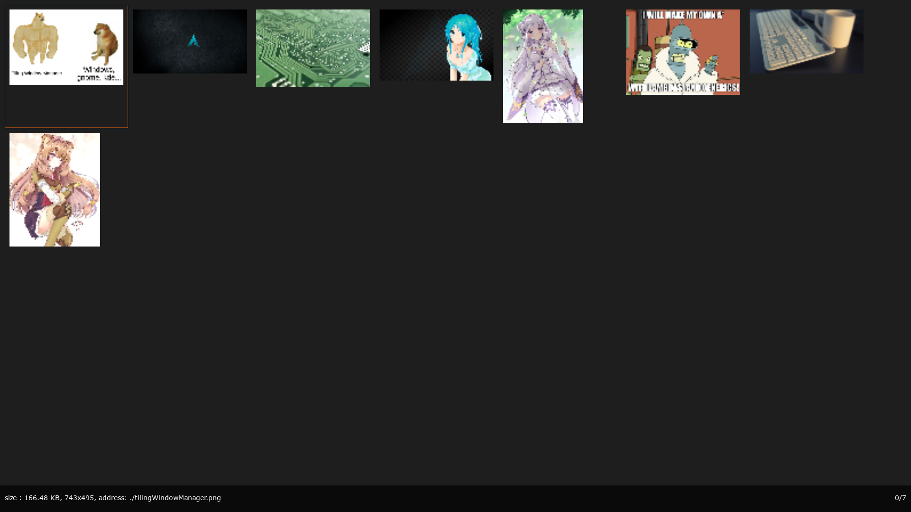

# Another image viewer
An image viewer implementation using C++17 and SDL2. It is heavily inspired on sxiv.

## Features

- Keyboard input only. Vim-like commands.
- When the program is closed, it will resume to the same image position when opened again with similar arguments. The way it works is that when you close the image viewer, is saves the path of the current image to a cache file. When you open it again and one of the input filenames matches a string in the cache, it moves the cursor to that image.

## Usage
The command is "aiv". You can insert as command line arguments the filenames or directories for it to search images. You can also input the filenames or directories by pipeline.

## Requirements to compile
clang 14.00+, meson, Make, Linux system.

## Keyboard input:
### General:
- f: toggle fullscreen
- n: next image
- "SPACE": next image
- p: previous image
- g: go to first image
- G: go to last image
- "ENTER": Toggle between grid view and image view
- b: toggle bottom bar information
- q: exit the image viewer
	
### Grid image mode
- +: Zoom up grid
- -: Zoom down grid
- j: move down
- k: move up
- h: move left
- l: move right
### Image viewer mode
- +: Zoom up image
- -: Zoom down image
- j: move down
- k: move up
- h: move left
- l: move right
- e: fit image to the width of the window
- E: fit image to the height of the window
- <: rotate left
- <: rotate right
	
## Commands
- make: builds the project
- make install: builds and copies the executable to $(HOME)/.local/bin/aiv
- make test: builds and executes the tests

## TODO
- set/unset bilinear interpolation as command line argument
- New view mode: Continuous. It renders all images in a vertical or horizontal line, contiguous to each other.
- Change "cacheFilenames.hpp" so it also works on windows
